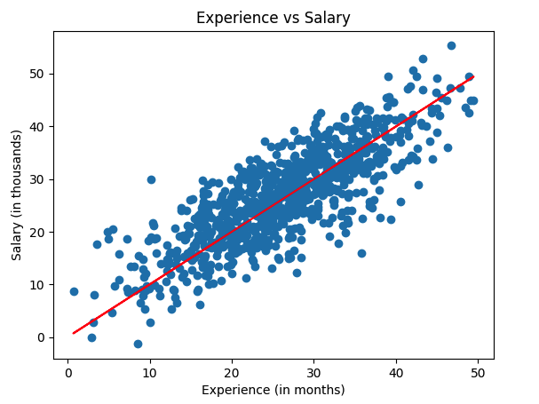
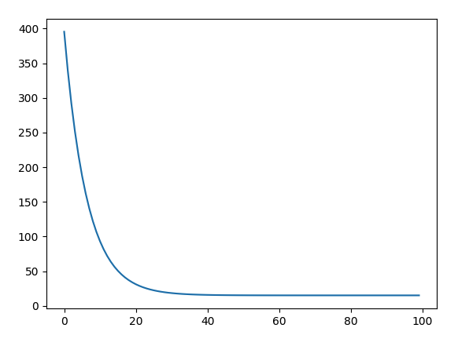

# AI Salary Prediction

A simple machine-learning project that predicts a person’s salary (in thousands) based on their years of experience using **Linear Regression**.  
This project is fully implemented **from scratch** using only **NumPy** for calculations and **Matplotlib** for visualization.

## 🚀 Project Overview

This project demonstrates how linear regression works internally by manually implementing:

- Cost Function (Mean Squared Error)
- Gradient Descent Optimization
- Weight & Bias updates
- Training & Testing split
- Prediction logic
- Visualization of regression line

No machine-learning libraries (like scikit-learn) were used.

## 📊 Dataset

- **Source:** Downloaded dataset  
- **Total rows:** 1000  
- **Training data:** 900 rows  
- **Testing data:** 100 rows  
- **Feature (X):** Years of Experience  
- **Target (y):** Salary (in thousands)

## 🧠 How It Works

1. Start with random weight `w` and bias `b`.
2. Predictions are calculated as:

   $y = wx + b$

3. Compute cost using Mean Squared Error (MSE).
4. Update parameters using Gradient Descent:

   $w := w - \alpha \frac{\partial J}{\partial w}$
   
   $b := b - \alpha \frac{\partial J}{\partial b}$

5. Repeat for multiple iterations until convergence.
6. Plot two graphs:
   - Regression line with data points  
   - Cost vs Iterations curve  

## 📦 Requirements

Go to directory

```bash
source .venv/bin/activate
```

Install the required libraries:

```bash
pip install numpy matplotlib
```

## ▶️ How to Run

```bash
python src/app.py
```

## 📈 Visualizations

This project generates:

### 1. Regression Line
Shows how well the trained model fits the data.



### 2. Cost vs Iterations
Illustrates how the loss decreases during training.



## 🔮 Future Improvements

- Support multiple features (multivariate linear regression)
- Add regularization (L2 / Ridge)
- Compare results with scikit-learn implementation
- Add a simple UI or API for making predictions

## 📜 License

This project is open-source and free to use for learning and experimentation.
